# mindswap

[](https://www.npmjs.com/package/mindswap)
[](https://opensource.org/licenses/MIT)

**Your AI's black box recorder.** CLI + MCP server.

One command captures your entire project state. Switch between Claude Code, Cursor, Copilot, Codex — the next AI picks up instantly. Zero re-explaining.

<p align="center">
  
</p>

```bash
npm install mindswap --save-dev
npx mindswap init        # once — auto-detects everything
npx mindswap             # save state when switching tools
npx mindswap doctor      # diagnose setup, context freshness, and gaps
npx mindswap mcp-install # enable MCP for Claude Code / Cursor
```

## The problem

You're mid-feature in Codex. Tokens run out. You switch to Claude Code. It has **zero context** — doesn't know your architecture, your decisions, or that you're halfway through implementing auth middleware.

You spend 20 minutes re-explaining. Every. Single. Time.

## The solution

Just run `mindswap`. That's it.

```bash
$ npx mindswap

⚡ Saving project state...

  Task:      user auth (auto-detected from branch)
  Branch:    feat/user-auth
  Changed:   4 files
  Tests:     ✓ 12 passed, 0 failed
  Decisions: 2 auto-logged from deps

✓ State saved — ready to switch tools
```

It auto-detects your task from the branch name, captures git state, logs dependency changes as decisions, and generates context files for **every AI tool**:

| AI Tool | Generated File | Behavior |
|---------|---------------|----------|
| Universal | `HANDOFF.md` | Full overwrite |
| Claude Code | `CLAUDE.md` | Safe merge |
| Cursor | `.cursor/rules/mindswap-context.mdc` | Own file |
| GitHub Copilot | `.github/copilot-instructions.md` | Safe merge |
| Codex | `CODEX.md` | Safe merge |
| Gemini CLI | `GEMINI.md` | Safe merge |
| Windsurf | `.windsurfrules` | Own file |
| Cline | `.cline/mindswap-context.md` | Own file |
| Roo Code | `.roo/rules/mindswap-context.md` | Own file |
| Aider | `CONVENTIONS.md` | Safe merge |
| Amp | `.amp/mindswap-context.md` | Own file |
| AGENTS.md | `AGENTS.md` | Safe merge |

## The entire flow

```bash
npx mindswap init     # once per project
npx mindswap doctor   # sanity-check setup and context health
npx mindswap          # when switching tools
npx mindswap done     # when feature is complete
```

Everything else is automatic — git hooks track commits, dependencies are auto-logged, branch state is auto-managed.

## 11 commands

| Command | Alias | What it does |
|---------|-------|-------------|
| `mindswap` | `save` | **THE one command.** Auto-detects task, deps, state — generates all context files |
| `mindswap init` | — | Initialize. Auto-detects 30+ frameworks, imports existing AI context files |
| `mindswap switch <tool>` | `sw` | One-command tool switch — save + generate + open (cursor/claude/copilot/codex/windsurf) |
| `mindswap done [msg]` | `d` | Mark task complete, archive to history, reset to idle |
| `mindswap log <msg>` | `l` | Log a memory item. Decisions warn on conflicts; use `--type` for blockers, assumptions, questions, and resolutions |
| `mindswap status` | `s` | Current state — task, branch, build/test, conflicts. `--stats` for charts |
| `mindswap doctor` | — | Diagnose setup, hook health, stale context files, conflicts, and missing continuity signals. `--json` for automation |
| `mindswap summary` | `sum` | Full session narrative — task, commits, decisions, conflicts. `--json` for scripts |
| `mindswap gen --all` | `gen` | Generate context files for all AI tools. Safe merge — never overwrites |
| `mindswap watch` | `w` | Background watcher — auto-updates HANDOFF.md on file changes |
| `mindswap reset` | `r` | Clear task state. Decisions preserved. `--full` to clear everything |

## Key features

### Auto-everything
- **Task detection** — from branch name (`feat/user-auth` → "user auth") + recent commits
- **Dependency tracking** — added Stripe? Auto-logged. Removed Redis? Logged too. Works across JS/TS, Python, Go, Rust, and Ruby manifests.
- **Git hooks** — auto-saves state on every commit

### Branch-aware state
Each git branch has its own state. Switch to `feat/payments` — it loads that branch's task and decisions. Switch back to `main` — your main state is restored.

### Native session normalization
mindswap reads recent Claude Code and Codex session files, normalizes them into a structured model, and surfaces the last session's findings, blockers, and edited files in `HANDOFF.md` and MCP context.

### Decision conflict detection
Log "NOT using Redis" then later "using Redis"? mindswap warns you. Also catches reversed choices and package.json contradictions.

### Structured memory
Not everything is a decision. mindswap now keeps structured memory for blockers, assumptions, open questions, and resolutions in `.mindswap/memory.json`, while keeping `decisions.log` for compatibility and conflict checks.

```bash
npx mindswap log "Need prod webhook secret" --type blocker
npx mindswap log "Assume single-region rollout for MVP" --type assumption
npx mindswap log "Should we rotate refresh tokens?" --type question
npx mindswap log "Moved to JWT after auth review" --type resolution
```

Generated context files surface unresolved blockers and questions separately so the next AI does not have to infer them from free-form notes.

### Continuity diagnostics
```bash
npx mindswap doctor
```
Checks whether mindswap is initialized correctly, whether generated handoff files are stale, whether git hooks are installed, whether AI-tool-specific context files are missing, and whether conflicts or weak continuity signals need attention.

### Safe merge
Already have a CLAUDE.md? mindswap appends its section inside `<!-- mindswap:start/end -->` markers. Your content is never touched.

### Build/test tracking
```bash
npx mindswap --check   # runs tests, captures results
# Tests: ✓ 47 passed, 0 failed
```
The next AI knows "tests were passing" or exactly what's broken.

### 30+ frameworks detected
Next.js, Remix, Astro, SolidJS, Angular, NestJS, Express, Fastify, Hono, Django, FastAPI, Flask, Gin, Echo, GoFr, Fiber, Actix, Axum, Rails, Spring Boot, and more. Plus databases, monorepo tools, CI/CD, and infrastructure.

## What lives in `.mindswap/`

```
.mindswap/
├── HANDOFF.md       ← any AI reads this
├── state.json       ← machine-readable state
├── decisions.log    ← decision log (kept for compatibility + conflicts)
├── memory.json      ← structured memory: blockers, assumptions, questions, resolutions
├── config.json      ← your preferences
├── branches/        ← per-branch state (auto)
└── history/         ← checkpoint timeline
```

**Commit these** (handoff context): `state.json`, `decisions.log`, `memory.json`, `config.json`, `HANDOFF.md`

**Don't commit** (auto-added to .gitignore): `history/`, `branches/`

## MCP Server

AI tools can query mindswap natively via [Model Context Protocol](https://modelcontextprotocol.io/) instead of reading static files. 3 tools, stdio transport.

```bash
npx mindswap mcp-install   # auto-configures Claude Code, Cursor, VS Code
```

| MCP Tool | When AI calls it | What it returns |
|----------|-----------------|-----------------|
| `mindswap_get_context` | Session start — "What do I need to know?" | Synthesized briefing: task, decisions, conflicts, tests, recent work, native session findings |
| `mindswap_save_context` | Session end — "Here's what I did" | Persists summary, decisions, next steps, blockers |
| `mindswap_search` | Mid-session — "What did we decide about auth?" | Searches decisions + history + state |

Only 3 tools by design. [Research shows](https://dev.to/aws-heroes/mcp-tool-design-why-your-ai-agent-is-failing-and-how-to-fix-it-40fc) AI accuracy drops from 82% to 73% past 20 tools. We chose quality over quantity.

## Security

All generated context files are scanned for secrets before writing:
- 25+ patterns: AWS keys, GitHub tokens, Stripe keys, OpenAI keys, DB URLs, private keys, JWT secrets, passwords
- Auto-redacted — secrets never reach your HANDOFF.md
- Placeholder-aware — skips `YOUR_KEY_HERE` patterns

## PR Integration

```bash
npx mindswap pr   # adds context summary to your GitHub PR
```

Auto-injects task, decisions, test status into the PR description with safe markers.

## FAQ

**Will it overwrite my existing CLAUDE.md?**
No. Uses `<!-- mindswap:start/end -->` markers. Your content is preserved.

**Does it work with my AI tool?**
If it reads markdown files (all of them do), yes.

**Does it slow things down?**
No. Only runs when you call it. Git hook runs silently on commit.

**Multiple branches?**
State is auto per-branch. Switch branches, state switches too.

**What languages?**
JS/TS, Python, Go, Rust, Ruby, Java/Kotlin. Auto-detects from project files.

## License

MIT
